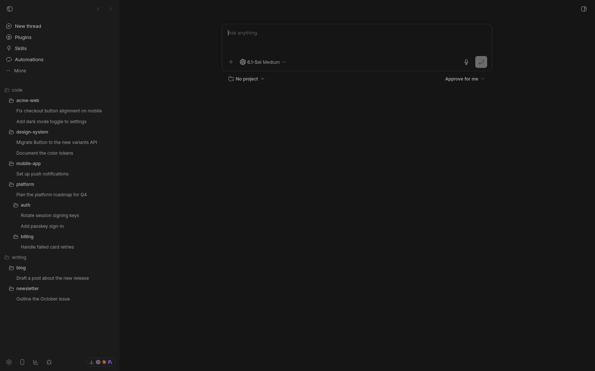
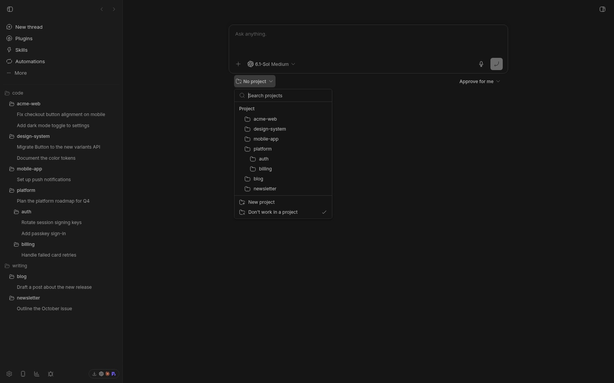

# bb-plugin-tree-sidebar

A sidebar thread list (and new thread project picker) shaped like your filesystem.



With `indentProjectNames` on, bb's new-thread project picker is indented to
match the tree:



## Installing it

```sh
bb plugin install git:github.com/chadbailey59/bb-plugin-tree-sidebar
```

## Turning it on

Settings → Appearance → Sidebar → **Tree sidebar**. The choice is per client, and
bb falls back to its built-in list if this plugin is disabled or removed.

## Using it

There are a few options in Settings → Tree Sidebar. Turn them on. If you don't like what they do, turn them off.

Don't like how it collapses folder hierarchies or something? You've got a brilliant code agent at your fingertips! Fork it and make it do what you want. This is the future!

If you come up with something awesome, feel free to open a PR. Happy bb'ing!
